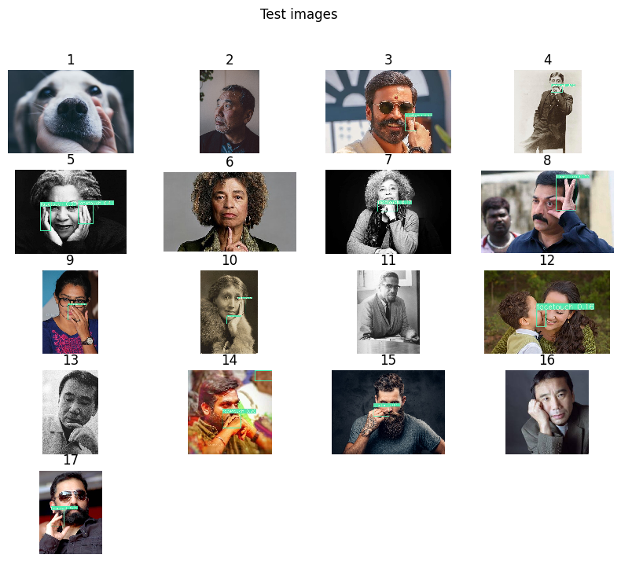

The code is based(mostly all NN code) on the [ultralytics/yolov3](https://github.com/ultralytics/yolov3)
and is freely available for redistribution under the GPL-3.0 license. The original repository is licensed
under GPL-3.0, hence the license is GPL-3.0.


The neural network to detect human face touch in an image or video stream using Yolo V3.
The idea comes from Keras creator [Francois Chollet tweet](https://twitter.com/fchollet/status/1234883862385156098?s=21).

### Demo

Here is the network prediction on a [clip of Slavoj Zizek](demo_videos/slavoj_zizek_touches_his_face.mp4)

Source:

<iframe width="560" height="315" src="https://www.youtube.com/embed/YvJocp4Ovzg" frameborder="0" allow="accelerometer; autoplay; encrypted-media; gyroscope; picture-in-picture" allowfullscreen></iframe>


Network output on the first ten second clip of the original video

<iframe width="560" height="315" src="https://www.youtube.com/embed/n44WsmRiAvY" frameborder="0" allow="accelerometer; autoplay; encrypted-media; gyroscope; picture-in-picture" allowfullscreen></iframe>

Prediction on set of [17 images](demo_images)



### Installation (Mac)
- `conda env create -f environment.yml`. This is for Mac OSX.
- `conda activate facetouch`.

### Installation (Non-Mac)

- Create a virtual environment and install requirements using conda and pip.
- `conda install cython numpy`
- `pip install -r requirements.txt`.

If you issue with installation, all you need is the following libraries,
`pytorch, torchvision, matplotlib, pycocotools, numpy, opencv-python, opencv-python-headless`.

TODO: Add the dockerfile


### Inference(after installation)

- Download the pretrained weights, `gdown https://drive.google.com/uc?id=16lYS4bcIdM2HdmyJBVDOvt3Trx6N3W2R`.
- Remove the webcam lid or sticker(if any),
`python detect.py --cfg cfg/yolov3-1cls.cfg --weights best_dataset_v5.pt --source 0`.
- Note, while rendering the UI (QT) for webcam or audio, the depending on OS, you may encounter errors.
- To run on set of images or videos, run the command,
`python detect.py --cfg cfg/yolov3-1cls.cfg --weights best_dataset_v5.pt --source test_images`.
The output is stored in `output` directory.


### Training

- The documentation for transfer learning is available in the original [repo wiki](https://github.com/ultralytics/yolov3/wiki/Example:-Transfer-Learning).
- Download the dataset using gdown `gdown https://drive.google.com/uc?id=1ziZ0Bw40KE4pfxezyjq7FMzOntDNNzuu`.
- Unzip the dataset, `unzip dataset_v5.zip`.
- Download the pretrained weights from ultralytics, `gdown https://drive.google.com/uc?id=16lYS4bcIdM2HdmyJBVDOvt3Trx6N3W2R`.
- Train the network, `python train.py --weights yolov3-spp.weights --data dataset_v5/coco1.data --cfg cfg/yolov3-1cls.cfg`.
- The train will run 300 epochs and store the results in the `weights` directory.
The `best.pt` is the `weights` is used for later inference.


### Dataset Creation

- To download the images for training, you can run the file `face_touch_download.py` like
`python face_touch_download.py --keyword "chin leaning" --limit 500 --dest chin_leaning`.
The above command opens the firefox web browser, sends the keyword "chin leaning"
to google, downloads first 500 images to the directory `chin_leaning`.
You need to have Firefox Selenium plugin.

- To annotate the downloaded images, you can use [LabelImg](https://github.com/tzutalin/labelImg).
Install `pip install labelimg`. You can annotate the images like `labelimg <images> coco1.names`.
The annotation will be stored in the same directory. Do it for all images directories.

- Now there are images and annotation. Create the dataset using following command,
`$python dataset.py --directories face_touch --directories chin_leaning --name dataset_v5`.
This will create `dataset_v5` directory and zip file with `labels` and `images` directories along with train and valid split.

```bash
$ls -lat dataset_v5
total 128
drwxr-xr-x  59 user  staff   1888 Mar 15 22:02 ..
-rw-r--r--   1 user  staff     91 Mar 15 17:24 coco1.data
drwxr-xr-x   9 user  staff    288 Mar 15 17:24 .
-rw-r--r--   1 user  staff     10 Mar 15 17:24 coco1.names
-rw-r--r--   1 user  staff   4819 Mar 15 17:24 test.txt
-rw-r--r--   1 user  staff   7051 Mar 15 17:24 val.txt
-rw-r--r--   1 user  staff  36893 Mar 15 17:24 train.txt
drwxr-xr-x   5 user  staff    160 Mar 15 17:24 labels
drwxr-xr-x   5 user  staff    160 Mar 15 17:24 images
$ls -lat dataset_v5/images/
total 0
drwxr-xr-x    9 user  staff    288 Mar 15 17:24 ..
drwxr-xr-x  106 user  staff   3392 Mar 15 17:24 test
drwxr-xr-x    5 user  staff    160 Mar 15 17:24 .
drwxr-xr-x  158 user  staff   5056 Mar 15 17:24 val
drwxr-xr-x  782 user  staff  25024 Mar 15 17:24 train
```

- The data used for training can be found in Google Drive in the name
`dataset_v5.zip` - https://drive.google.com/drive/u/0/folders/17-rLAQ9GLda7M5mvDiitINqSLBUj_wbm
